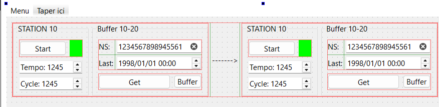
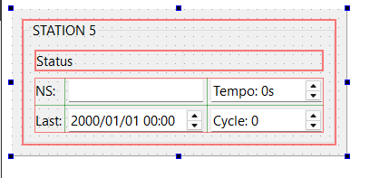
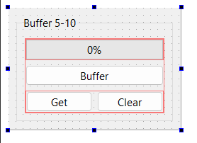
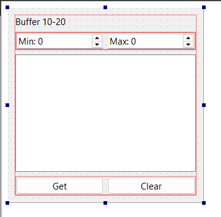
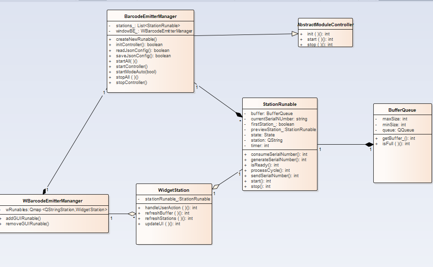

# C++ chez Autoliv — BarcodeEmitter → BceManager

Alternance ingénieure logicielle chez **Autoliv** (site de Gournay-en-Bray), sur **ATRAQ**, le logiciel maison de traçabilité industrielle codé en C++ depuis 2001.

Ce dépôt documente ma mission de deuxième année : reconcevoir **BarcodeEmitter**, un outil isolé et non maintenu depuis 2016, en un module natif de l'écosystème AutomAtraq appelé **BceManager**. Il retrace le projet de la phase de conception jusqu'aux tests unitaires, avec des captures réelles issues de mon rapport d'alternance.

> Présenté avec l'accord de mon tuteur en entreprise — architecture et méthodologie uniquement, **sans code source**.

## Le point de départ

BarcodeEmitter génère des numéros de série de codes-barres et simule un scanner sur une ligne de production, sans matériel réel. Construit en 2016, il ne gérait qu'un seul poste à la fois, avec une interface et une persistance d'état fragiles — inadapté aux lignes de production multi-postes actuelles.

Plutôt que de rapiécer l'existant, la décision (validée avec mon tuteur Stéphane Moignard et mon collègue Bastien Briand) a été de reconstruire un module complet, intégré nativement à AutomAtraq comme les autres modules (APIManager, SeqManager).

## Les huit phases du projet

| # | Phase | Statut |
|---|-------|--------|
| 1 | Analyse du système existant | Terminé |
| 2 | Conception de l'interface graphique | Terminé |
| 3 | Conception technique et architecture | Terminé |
| 4 | Développement de l'interface | Terminé |
| 5 | Développement backend | Terminé |
| 6 | Intégration interface / backend | Terminé |
| 7 | Écriture des tests unitaires | En cours |
| 8 | Formalisation et présentation de l'architecture à l'équipe | À venir |

*(Source : tableau des tickets Jira de mon rapport d'alternance)*

## Phase 2 — Conception de l'interface graphique

Avant de coder la moindre ligne, j'ai maquetté chaque écran et chaque interaction sous Qt Designer, pour valider les besoins fonctionnels avec mon équipe.

*Maquette d'un couple Station/Buffer : chaque bloc Station regroupe le bouton Start, le voyant d'état et les paramètres Tempo/Cycle ; le bloc Buffer associé affiche le numéro de série courant, la date de dernière émission et les actions Get/Buffer.*

*Widget Station : statut de la station, numéro de série en cours, temporisation du cycle et nombre de cycles réalisés.*

*Le widget Buffer, en vue compacte (indicateur de remplissage en %) et en vue détaillée (liste des numéros de série générés, capacité min/max configurable).*

Ces maquettes ont été présentées à mon tuteur et à mon collègue pour valider les fonctionnalités avant tout développement — une revue en amont qui a permis de résoudre les interactions essentielles avant d'écrire du code.

## Phase 3 — Conception technique et architecture

Avec l'interface définie, l'étape suivante a été d'identifier les classes clés du module, leurs responsabilités et leurs relations, en cohérence avec le style architectural déjà en place dans AutomAtraq.

*Diagramme de classes du module. `BarcodeEmitterManager` implémente l'interface commune `AbstractModuleController` et pilote l'ensemble des `StationRunable` ; chaque station détient un `BufferQueue` partagé avec sa station complémentaire pour échanger les numéros de série. Côté interface, `WBarcodeEmitterManager` fait le lien avec les widgets `WidgetStation` affichés à l'écran.*

Le défi principal identifié à ce stade : un même `BufferQueue` pouvant être accédé simultanément par plusieurs stations, la gestion de la concurrence (via `QMutex`) devenait incontournable — mon premier vrai sujet de programmation multithread.

## Phases 4 à 6 — Développement et intégration

- **Interface** développée en premier, sur la base des maquettes, avec la plupart des éléments d'abord statiques pour valider les états visuels avant de les connecter à la logique métier.
- **Backend** : gestion du buffer (accès thread-safe via `QMutex`), système de journalisation dédié (`App_BCE_Manager.log`, catégorie `APP_BCE_MANAGER`), lancement/arrêt du module intégré au mécanisme commun d'AutomAtraq, implémentation de `BarcodeEmitterManager` (en prenant `Pac1Manager` comme référence), portage de `SerialPortConf` (en s'appuyant sur `Pac1Printer` et `APIRequest`, et en retirant un paramètre devenu inutile, `generateTimer_`), puis persistance JSON de la configuration.
- **Intégration** interface/backend via le mécanisme signal/slot de Qt, dans les deux sens.

Trois défis principaux ont marqué cette phase : construire une architecture multi-station là où l'existant ne gérait qu'un seul poste, reprendre et adapter du code hérité sans le recopier tel quel, et réestimer un calendrier qui s'est révélé bien plus long que prévu — l'intégration de BarcodeEmitter, estimée à ~1 mois avec mon tuteur, en a finalement demandé 6, non pas par retard mais par sous-estimation initiale de l'ampleur réelle du sujet.

## Phase 7 — Tests unitaires *(en cours)*

Dernière ligne droite du projet : consolider la couverture de tests sur les classes cœur du module, en particulier sur les sujets de concurrence (accès au buffer partagé) et de sérialisation (chargement/sauvegarde JSON) introduits pendant le développement. C'est la phase sur laquelle je termine actuellement mon alternance, avant la formalisation de l'architecture devant l'équipe (phase 8).

## Ce que ce projet m'a appris

Concevoir une architecture multi-station avec état partagé et accès concurrents a été un vrai saut de complexité par rapport à ma première année, centrée sur la stabilisation de tests existants. Cette mission m'a aussi appris à mieux découper un projet complexe en sous-tâches vérifiables avant d'en estimer la durée, et à documenter un module de façon à ce que sa reprise, après mon départ, ne nécessite pas ma présence.

---

**Marylyne Adisso** · ESIGELEC, promotion 2026 · Alternance Autoliv, 2023–2026
Présentation réalisée avec l'accord de mon tuteur en entreprise — architecture, méthodologie et maquettes d'interface uniquement, sans code source ni captures internes de code.
